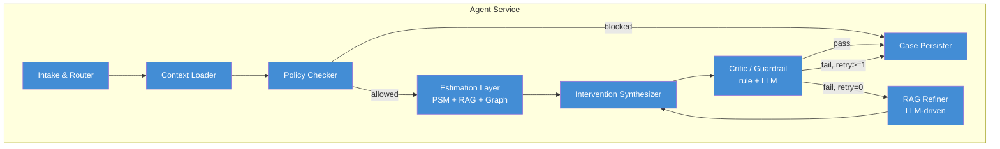

# C4 Component: Agent Service

Внутреннее устройство Agent Service — компоненты исполнения кейса.

## Интерфейсы компонентов

| Компонент | Входы из CaseState | Выходы в CaseState |
|-----------|-------------------|---------------------|
| Intake & Router | `raw_query` или structured input | `case_id`, `client_id`, `intervention_delta` |
| Context Loader | `client_id` | `client_context` |
| Policy Checker | `client_context`, `intervention_delta` | `policy_result` |
| Estimation Layer | `client_context`, `intervention_delta` | `psm_result`, `rag_chunks`, `graph_dsl` |
| Intervention Synthesizer | Контекст кейса и evidence | `explanation` |
| Critic / Guardrail | `explanation` и evidence | `critic_result` (rule_issues + llm_issues), `retry_count` |
| RAG Refiner | `critic_result.issues`, `rag_query_history` | Дополненный `rag_chunks`, `rag_iterations`, `rag_query_history` |
| Case Persister | Полное состояние кейса | `status`, `latency_ms`, запись в SQLite |

> `CaseState` — общий транспорт между узлами, не показан как отдельный компонент чтобы не перегружать схему.
