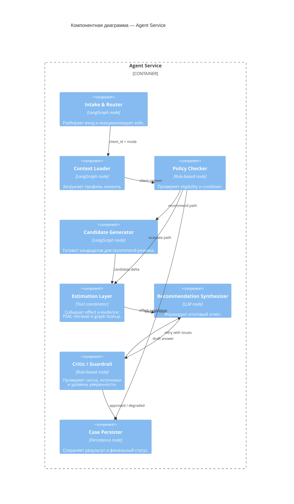

# C4 Component: Agent Service

Внутреннее устройство `Agent Service` — основные компоненты исполнения кейса и их связи.

## Интерфейсы компонентов

| Компонент | Входные поля из CaseState | Выходные поля в CaseState |
|-----------|--------------------------|---------------------------|
| Intake & Router | `raw_query` или structured input | `case_id`, `mode`, `client_id`, `intervention_delta` |
| Context Loader | `client_id` | `client_context` |
| Policy Checker | `client_context`, `intervention_delta` | `policy_result` |
| Candidate Generator | `client_context`, `policy_result` | candidate deltas для recommend-режима |
| Estimation Layer | `client_context`, `intervention_delta` | `psm_result`, `rag_chunks`, `graph_dsl` |
| Recommendation Synthesizer | Контекст кейса и evidence | `explanation` |
| Critic / Guardrail | `explanation` и evidence | `critic_result`, `retry_count` |
| Case Persister | Полное состояние кейса | финальный `status`, `latency_ms`, запись в SQLite |

> `CaseState` используется как общий транспорт состояния между узлами, но не выделяется в отдельный компонент на диаграмме, чтобы не перегружать схему.
