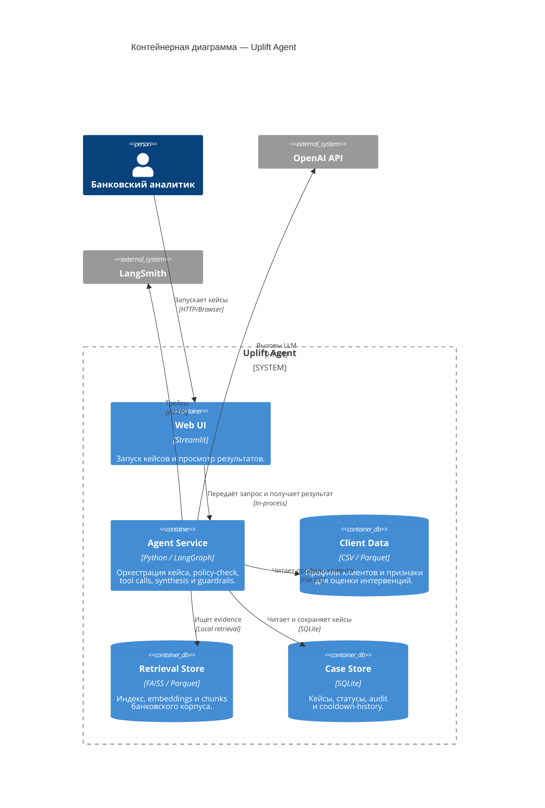

# C4 Container: Uplift Agent

Внутренняя структура системы: контейнеры (процессы, хранилища, UI) и их взаимодействие.

## Потоки данных между контейнерами

| От | К | Данные | Протокол |
|----|---|--------|----------|
| Web UI | Agent Service | Запрос пользователя и итоговый результат | In-process |
| Agent Service | Client Data | `client_id` → профиль клиента | File I/O |
| Agent Service | Retrieval Store | `query` → top-k чанки | Local retrieval |
| Agent Service | Case Store | Чтение cooldown-history и сохранение кейса | SQLite |
| Agent Service | OpenAI API | LLM request/response | HTTPS |
| Agent Service | LangSmith | Trace spans и метрики | HTTPS |
