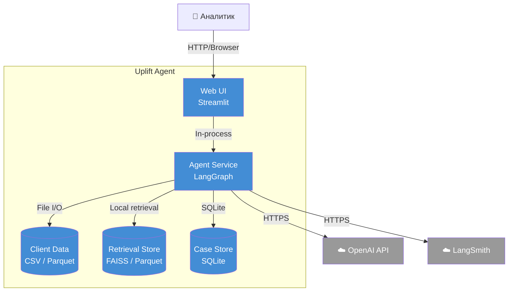

# C4 Container: Uplift Agent

Внутренняя структура системы: контейнеры, хранилища и внешние зависимости.

## Потоки данных

| От | К | Данные | Протокол |
|----|---|--------|----------|
| Web UI | Agent Service | Запрос пользователя и итоговый результат | In-process (planned: REST API, см. `specs/rest-api.md`) |
| Agent Service | Client Data | `client_id` → профиль клиента | File I/O |
| Agent Service | Retrieval Store | `query` → top-k чанки | Local retrieval |
| Agent Service | Case Store | Чтение cooldown-history и сохранение кейса | SQLite |
| Agent Service | OpenAI API | LLM request/response | HTTPS |
| Agent Service | LangSmith | Trace spans и метрики | HTTPS |
