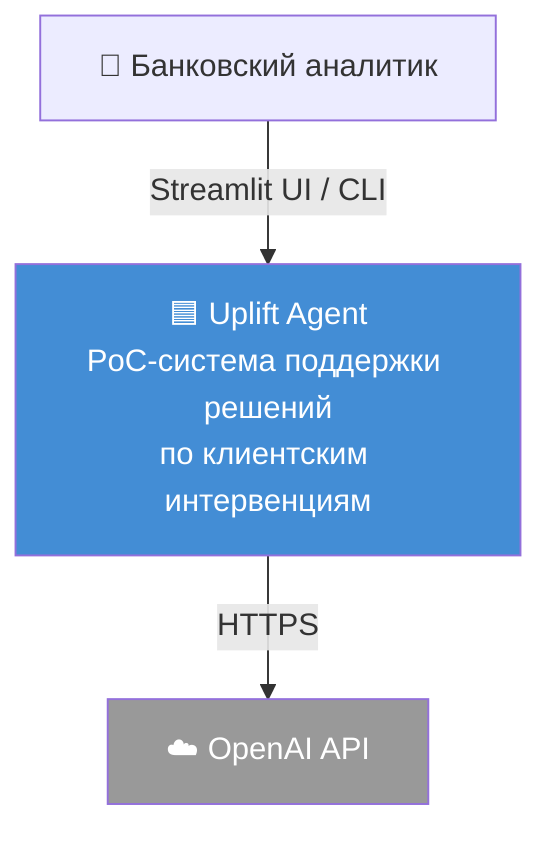

# C4 Context: Uplift Agent

Диаграмма верхнего уровня — система, пользователь, внешние сервисы.

## Участники

| Участник | Тип | Описание |
|----------|-----|----------|
| Банковский аналитик | Person | Пользователь PoC. Запускает кейсы и читает рекомендации. |
| Uplift Agent | System | Ядро: orchestration, tool calls, guardrails, финальный отчёт. Включает локальные данные (CSV клиентов, FAISS-индекс, SQLite). |
| OpenAI API | External | LLM для парсинга запросов и синтеза ответа. |

Внешний trace-бекенд (LangSmith, OpenTelemetry и т.п.) в v1 не подключён — observability строится на локальных Loguru-логах и SQLite audit trail. Интеграция — кандидат v2.

> Локальные хранилища (CSV, FAISS, SQLite) — часть системы. Детализация — в [C4 Container](c4-container.md).
