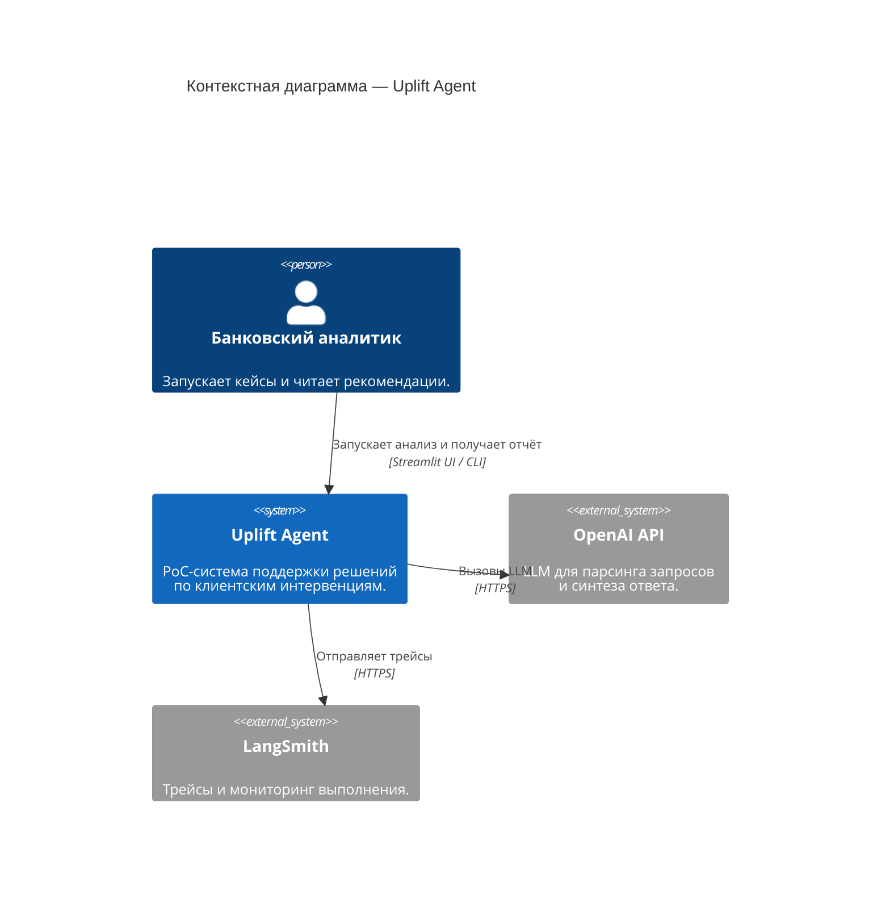

# C4 Context: Uplift Agent

Диаграмма верхнего уровня — система, пользователь, внешние сервисы и границы.

## Описание участников

| Участник | Тип | Описание |
|----------|-----|----------|
| Банковский аналитик | Person | Пользователь PoC, который запускает кейсы и читает рекомендации. |
| Uplift Agent | System | Ядро системы: orchestration, tool calls, guardrails и финальный отчёт. |
| OpenAI API | External System | Внешний LLM-провайдер для разбора запроса и синтеза ответа. |
| LangSmith | External System | Трейсинг и наблюдаемость выполнения пайплайна. |

> **Примечание:** Локальные данные и хранилища (CSV клиентов, retrieval-артефакты, SQLite) намеренно опущены на context-уровне и раскрываются в [C4 Container](c4-container.md).
