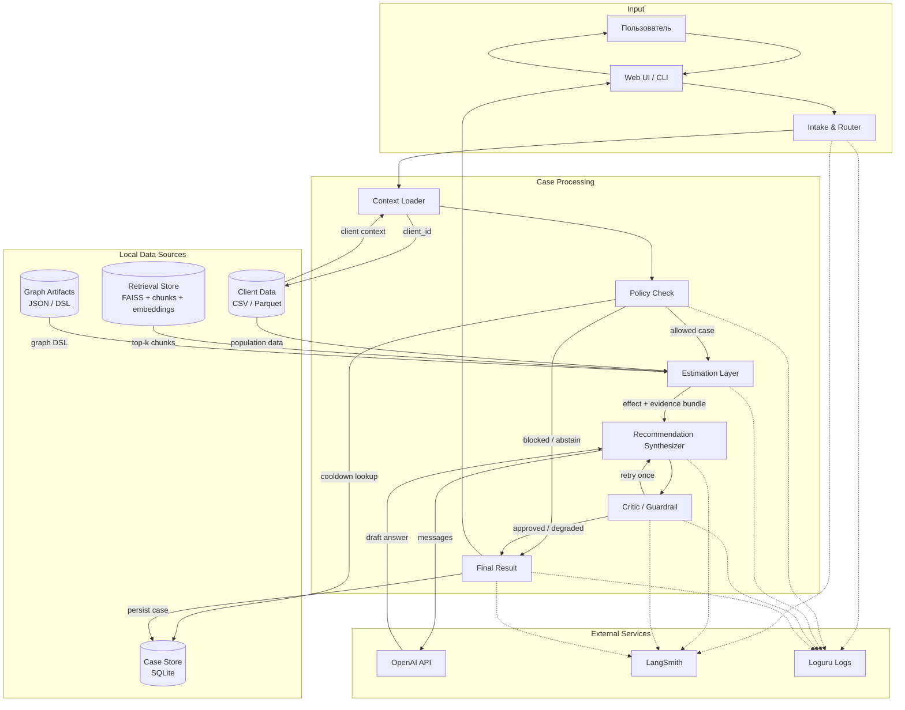

# Data Flow: Uplift Agent

Как данные проходят через систему, что хранится, что логируется.

## Основной поток данных

## Формат данных на каждом этапе

| Этап | Данные | Формат | Размер |
|------|--------|--------|--------|
| Input | `{client_id, mode, intervention_delta}` или NL-запрос | JSON / text | ~0.1-0.2 KB |
| Client Context | Профиль клиента и признаки | Dict -> JSON | ~1 KB |
| Policy Result | `{blocked, reasons, notes}` | Dict | ~0.2 KB |
| Evidence Bundle | `psm_result + rag_chunks + graph_dsl` | Mixed | ~6-7 KB |
| LLM Prompt | System + user messages | List[Message] | ~5K tokens |
| Explanation | Структурированный ответ и raw_text | Dict -> JSON | ~2 KB |
| Case Record | Запрос, контекст, результат, статус | SQLite row | ~5-10 KB |

## Что НЕ сохраняется и НЕ логируется

| Данные | Причина |
|--------|---------|
| Полные промпты с данными клиентов | PII, governance.md §2 |
| Полное содержимое RAG-документов | Объём, нерелевантно для audit |
| Сырые Open identifiers клиентов | Замена на псевдонимы, governance.md §3 |
| Matched DataFrame из PSM | Объём; сохраняются только агрегаты (ATE, ATT, n_pairs) |
