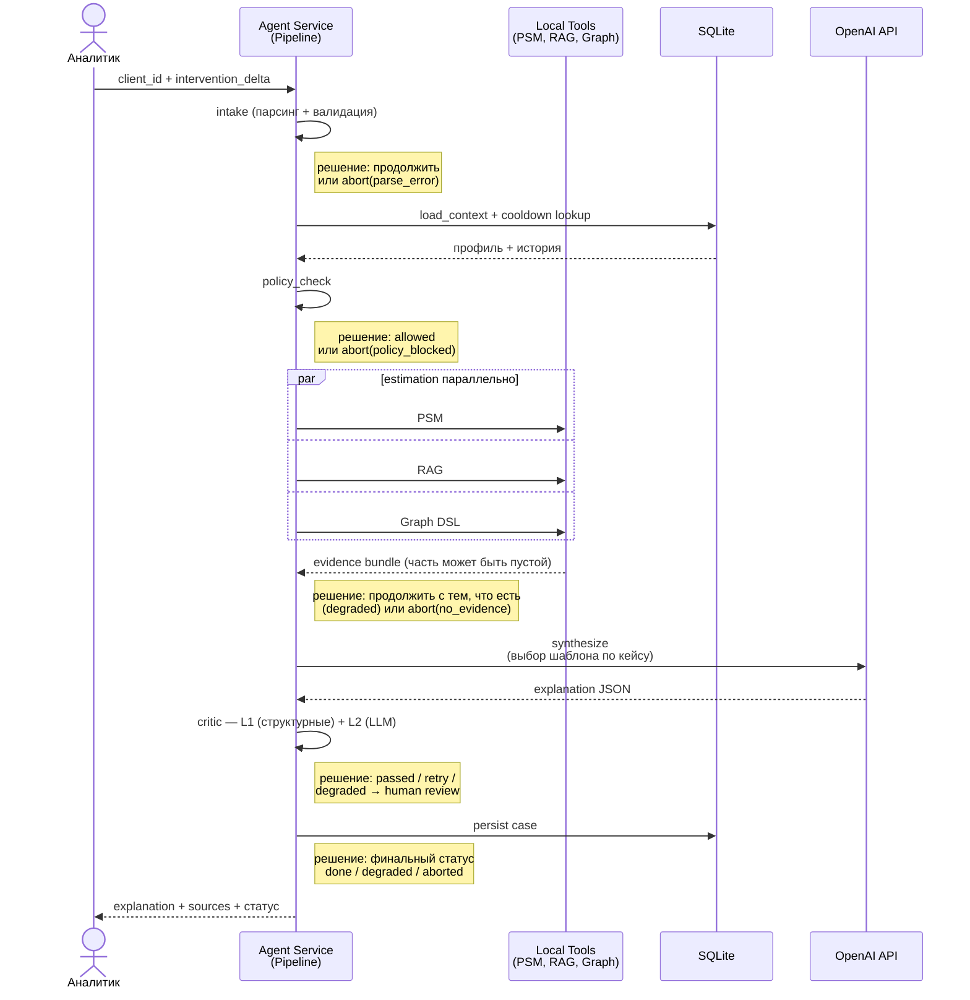

# Sequence: Happy Path

Sequence diagram для основного сценария «оценка заданной интервенции через Streamlit». Все 3 источника данных доступны, policy не блокирует, critic проходит с первой попытки.

Альтернативные пути (blocked policy, degraded mode, retry, abort) — см. `workflow.md`.

## Что покрывает диаграмма

- Один полный успешный кейс от запроса аналитика до возврата объяснения
- Параллельное выполнение PSM, RAG и Graph DSL внутри estimation
- Один LLM-вызов в Synthesizer без retry
- Сохранение в SQLite через Persister

## Где здесь агентность

Happy path — это **прямая ветка** workflow, поэтому LLM-driven циклы здесь не активируются. Реальная агентность системы видна в alternative paths и описана в ADR-8 (`system-design.md` §1):

**Rule-based safety floor** — детерминированные branching-точки, видимые на диаграмме как `решение: ...`:
- abort при parse_error / missing_intervention (`agent-orchestrator.md` §3.1)
- блокировка policy (`agent-orchestrator.md` §3.3)
- abort при `no_evidence` или продолжение в degraded (`agent-orchestrator.md` §3.4)
- классификация финального статуса и `requires_human_review` (`agent-orchestrator.md` §3.8)

**LLM-driven refinement loops** (НЕ активируются в happy path, см. `workflow.md`):
- **Adaptive RAG (`rag_refine`)** — после critic fail LLM формулирует уточнённый RAG-запрос на основе issues, инициирует повторный retrieval, затем synthesize. Max 2 итерации. Это первая точка, где LLM реально управляет вызовом инструмента (`agent-orchestrator.md` §3.7).
- **LLM-augmented critic (level 2)** — после прохождения rule-based структурных проверок (атрибуция источников, полнота ответа) LLM делает смысловой self-check (логическая консистентность, соответствие фактам, адекватность хеджирования, полнота рекомендаций). Issues от LLM-critic триггерят rag_refine + retry. На retry-проходе L2 не запускается — только L1 (`observability-evals.md` §4.4).

Тем самым в системе работает реальный LLM-in-the-loop pattern: **synthesize → critic (LLM) → rag_refine (LLM) → synthesize**, с жёсткими safety-границами от rule-based слоя.

> **Что НЕ делается в PoC** (осознанно): LLM-driven planner перед estimation, conditional tool selection через LLM, ReAct цикл с произвольным числом итераций. См. ADR-8 для обоснования.

## Что НЕ покрывает

- Блокировку policy (см. `workflow.md` ветка `blocked`)
- Degraded mode при недоступности одного из источников
- Retry в Critic / повторный synthesize
- Abort на любом этапе

Полный набор переходов — в `workflow.md` (state machine).
