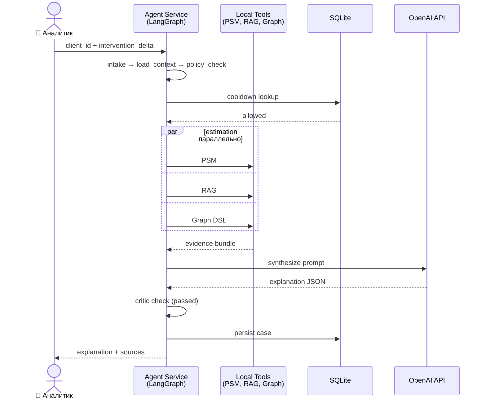

# Sequence: Happy Path

Sequence diagram для основного сценария «оценка заданной интервенции через Streamlit». Все 3 источника данных доступны, policy не блокирует, critic проходит с первой попытки.

Альтернативные пути (blocked policy, degraded mode, retry, abort) — см. `workflow.md`.

## Что покрывает диаграмма

- Один полный успешный кейс от запроса аналитика до возврата объяснения
- Параллельное выполнение PSM, RAG и Graph DSL внутри estimation
- Один LLM-вызов в Synthesizer без retry
- Сохранение в SQLite через Persister

## Что НЕ покрывает

- Блокировку policy (см. `workflow.md` ветка `blocked`)
- Degraded mode при недоступности одного из источников
- Retry в Critic / повторный synthesize
- Abort на любом этапе

Полный набор переходов — в `workflow.md` (state machine).
