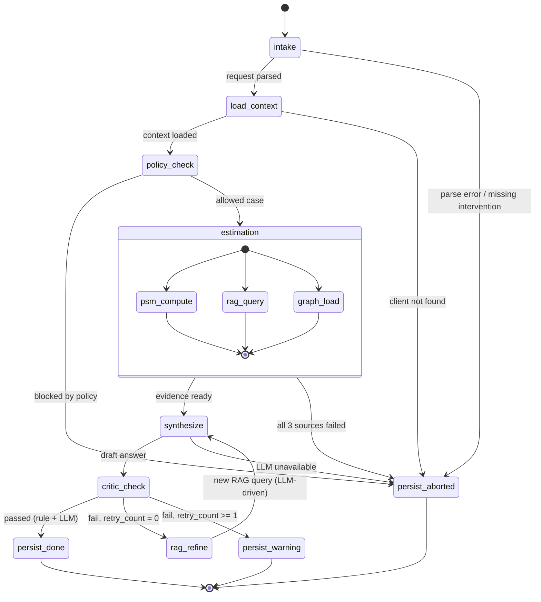
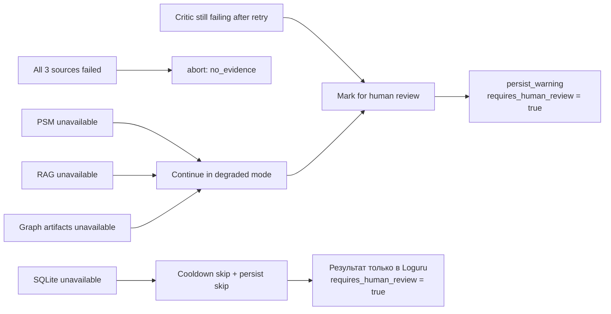

# Workflow: Pipeline State Machine

Пошаговое выполнение запроса через `Pipeline` orchestrator (`sme_causal/orchestrator/pipeline.py`). В v1 оркестратор — plain Python с ThreadPoolExecutor для параллельного estimation; готовые фреймворки графов состояний (LangGraph и т.п.) не используются — см. ADR-1 в `../system-design.md`.

## Основной workflow

## Failure Handling

