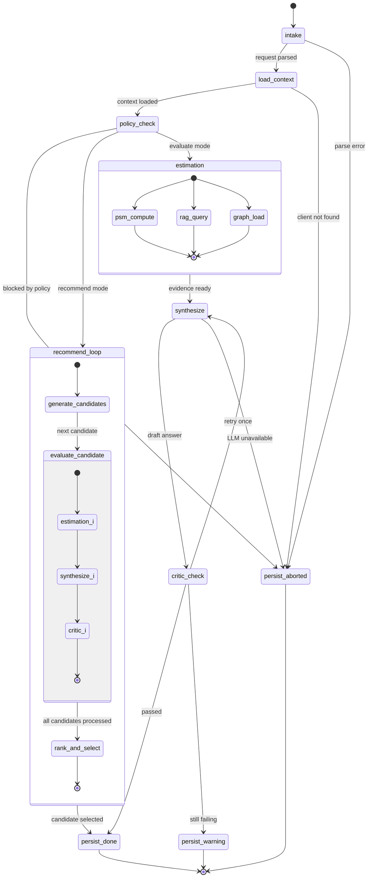
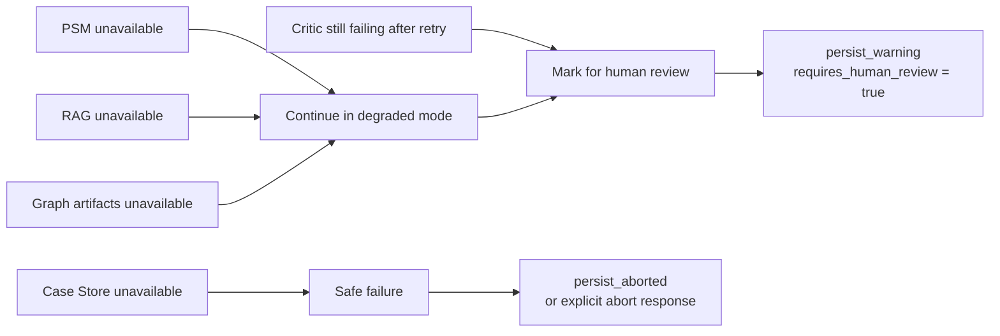

# Workflow: LangGraph State Machine

Пошаговое выполнение запроса через граф состояний LangGraph.

## Основной workflow

```mermaid
stateDiagram-v2
    [*] --> intake

    intake --> load_context : request parsed
    intake --> persist_aborted : parse error

    load_context --> policy_check : context loaded
    load_context --> persist_aborted : client not found

    policy_check --> recommend_loop : recommend mode
    policy_check --> estimation : evaluate mode
    policy_check --> persist_aborted : blocked by policy

    state recommend_loop {
        [*] --> generate_candidates
        generate_candidates --> evaluate_candidate : next candidate
        state evaluate_candidate {
            [*] --> estimation_i
            estimation_i --> synthesize_i
            synthesize_i --> critic_i
            critic_i --> [*]
        }
        evaluate_candidate --> rank_and_select : all candidates processed
        rank_and_select --> [*]
    }

    recommend_loop --> persist_done : candidate selected

    state estimation {
        [*] --> psm_compute
        [*] --> rag_query
        [*] --> graph_load
        psm_compute --> [*]
        rag_query --> [*]
        graph_load --> [*]
    }

    estimation --> synthesize : evidence ready

    synthesize --> critic_check : draft answer
    synthesize --> persist_aborted : LLM unavailable

    critic_check --> persist_done : passed
    critic_check --> synthesize : retry once
    critic_check --> persist_warning : still failing

    persist_done --> [*]
    persist_warning --> [*]
    persist_aborted --> [*]
```

## Failure Handling

```mermaid
flowchart LR
    PSM_FAIL[PSM unavailable] --> DEGRADED[Continue in degraded mode]
    RAG_FAIL[RAG unavailable] --> DEGRADED
    GRAPH_FAIL[Graph artifacts unavailable] --> DEGRADED
    CRITIC_FAIL[Critic still failing after retry] --> REVIEW[Mark for human review]
    STORE_FAIL[Case Store unavailable] --> SAFE_FAIL[Safe failure]

    DEGRADED --> REVIEW
    REVIEW --> PERSIST[persist_warning<br/>requires_human_review = true]
    SAFE_FAIL --> ABORT[persist_aborted<br/>or explicit abort response]
```
